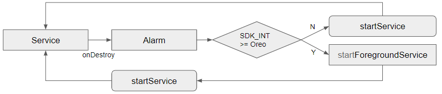

# ServiceExample #
This is a example to run startForeground() without showing notification.

It is an immortal service that can not be killed by Android.

An immortal service can be invoked by calling startForegroundService.

However, there is a problem that the notification is displayed.

There were several attempts to solve this problem, but it did not work.

This is an example of an attempt to solve this problem.

### Principle ###
- When the service is finished, the alarm is executed after 1 second.
- In the alarm,
- If it is an older version of android Oreo, just call startService to run the service.
- If the version is later than Oreo, call startForegroundService to execute the immortal service, and start service by calling startService in this immortal service.
- And then, terminate this immortal service.

### INSTALLATION ###
1. Clone this source from github (in android studio).
2. Run.
3. Quit app and check messages.

### License ###
MIT